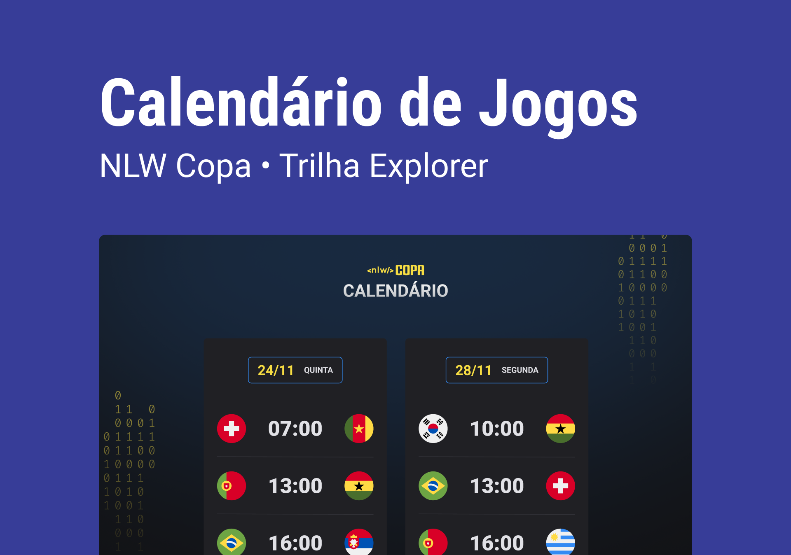

<h1 align="center"> NLW #10 - Calendário da Copa 2022 </h1>

Evento exclusivo e gratuito, promovido pela Rocketseat para ensino de tecnologias WEB.

  <a href="#-tecnologias">Tecnologias</a>&nbsp;&nbsp;&nbsp;|&nbsp;&nbsp;&nbsp;
  <a href="#-projeto">Projeto</a>&nbsp;&nbsp;&nbsp;|&nbsp;&nbsp;&nbsp;
  <a href="#-layout">Layout</a>&nbsp;&nbsp;&nbsp;|&nbsp;&nbsp;&nbsp;
  <a href="#memo-licença">Licença</a>

  

 

  

## 🚀 Tecnologias

Esse projeto foi desenvolvido com as seguintes tecnologias:

- HTML e CSS
- JavaScript
- Git

## 💻 Projeto

O Calendário da Copa é um projeto que exibi os jogos da copa do Catar 2022.

## 🔖 Layout

Você pode acessar o projeto [AQUI](https://nlw-copa-azure.vercel.app/), ou visualizar o layout do projeto através [DESSE LINK](<https://www.figma.com/file/DsQ7U9oLHy14tRROsGAGoz/Calend%C3%A1rio-de-Jogos-(Community)?node-id=0%3A1/duplicate>). É necessário ter conta no [Figma](https://figma.com) para acessá-lo.

## 👋🏼 Contatos

- [Linkedin](https://www.linkedin.com/in/marianectrodrigues/)
- marianectrodrigues@gmail.com

## :memo: Licença

Esse projeto está sob a licença MIT.

---

:wave: [Participe da comunidade da Rocketseat!](https://discord.gg/rocketseat)
